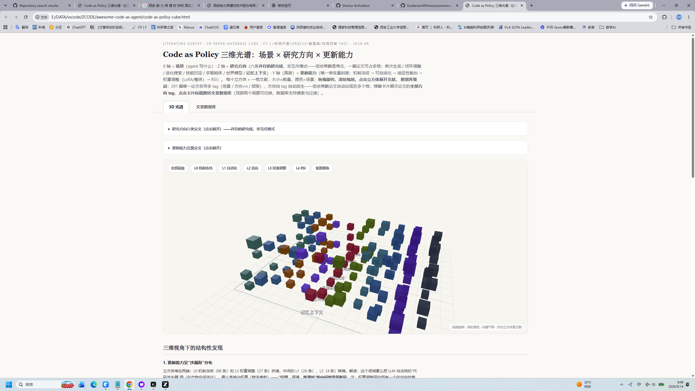
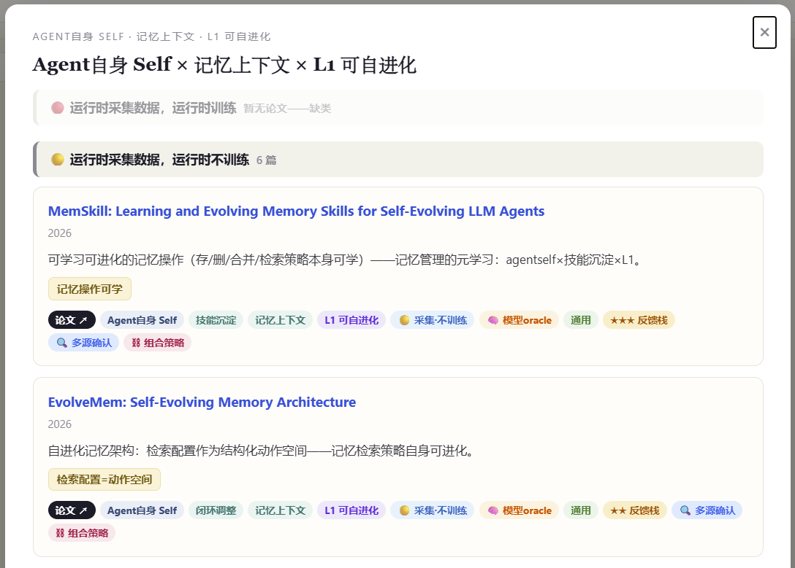

# Awesome Code as Agent

**中文版** | **[English](README.md)**

> 一张可导航的 3D 知识地图，收录 **291 篇论文**——LLM agent 如何用可执行代码感知、行动、学习和自我改进。覆盖 **10 个场景 × 7 个方向 × 5 层更新能力 × 4 象限运行时行为**。

**不只是读列表——导航整个空间。**

## 🧊 预览

| 3D 知识立方体 | 论文数据库 |
|:-:|:-:|
|  |  |
| 拖拽 · 缩放 · 点击立方体 | 搜索 · 过滤 · 8 维 tag |

## 快速开始

**第 1 步** — 克隆本仓库：

```bash
git clone https://github.com/ExuberantWitness/awesome-code-as-agent.git
cd awesome-code-as-agent
```

**第 2 步** — 在浏览器中打开 3D 立方体：

```bash
# macOS / Linux
open code-as-policy-cube.html

# Windows
start code-as-policy-cube.html

# 或者直接在文件管理器中双击该文件
```

> ⚠️ 需要联网（Three.js 从 CDN 加载）

**第 3 步** — 开始探索：

1. **拖拽旋转** 3D 晶格，滚轮缩放
2. **点击任何立方体** 查看该格论文，按运行时象限分组显示
3. **点击弹窗中的论文标题** → 跳转到数据库条目（含完整 tag）
4. **按更新层级过滤**（L0-L4），或切换到数据库视图做多维搜索
5. **发现研究空白** — 标注"暂无论文"的格子就是选题机会

## 四维分类体系

### X 轴：场景——agent 写什么？

| 场景 | 描述 | 篇数 |
|------|------|------|
| 🎯 策略 Policy | 代码即机器人/控制策略 | 24 |
| 🖱️ 动作 Action | 代码即统一动作空间（GUI/OS） | 26 |
| 🏆 奖励 Reward | 代码即奖励函数或训练管线 | 19 |
| 🔧 技能 Skill | 代码即可复用技能/库单元 | 16 |
| 🛡️ 约束 Constraint | 代码即可执行安全约束/监控 | 18 |
| 🌍 世界 World | 代码即世界模型/可执行世界表示 | 33 |
| 📐 设计 Design | 代码即设计产物（CAD/本体/法规） | 27 |
| 🧠 推理 Reasoning | 代码即推理介质 | 22 |
| 🤖 Agent 自身 | 代码即 agent 自己的架构/工作流 | 25 |
| 🔬 科研 Research | 代码即科研流程本身 | 26 |

### Z 轴：研究方向——agent 怎么写？

| 方向 | 哲学 |
|------|------|
| 单次生成 | 一次生成即交付，无迭代 |
| 闭环调整 | 生成→执行→诊断→修订 |
| 进化搜索 | 种群+并行评估+选择变异 |
| 技能沉淀 | "把一次性成功变成可检索的资产" |
| 多智能体 | 角色分工与协作 |
| 世界模型 | 反馈经由世界模型而非直接交互 |
| 记忆上下文 | 经验表示的管理本身在被改进 |

### Y 轴：更新能力——改进落在哪？

| 层级 | 名称 | 描述 |
|------|------|------|
| L0 | 机制冻结 | LLM 冻结，无自我改进 |
| L1 | 可自进化 | 改 prompt/流程/技能库，不动权重 |
| L2 | 适应性输出 | 推理时轻量适应，不留权重 |
| L3 | 权重调整 | 正式权重更新（LoRA 或整体 SFT/RL） |
| L4 | RSI | 自我更新且有加速趋势 |

### 时间象限——运行时行为（2 比特）

| | 训练 ✓ | 训练 ✗ |
|---|---|---|
| **采集 ✓** | 🔴 A：在线学习（52 篇） | 🟡 B：经验积累（128 篇） |
| **采集 ✗** | 🔵 C：输入流适应（6 篇） | ⚪ D：冻结（95 篇） |

## 附加 tag

- **反馈栈**：★ 证据构建 → ★★ 闭环验证 → ★★★ 资产飞轮
- **反馈 oracle 类型**：⚙ 符号 / 🖥 仿真 / 🧠 模型 / 🦾 真实物理 / 👤 人类
- **垂直域**：14 个（机器人/软件/数学/芯片/CAD/前端/本体/法规/建筑/药物…）
- **自指闭合**：🪞 改进对象是否包含改进者自身？

## 关键发现

1. **沙漏形分布**——L0（冻结）和 L3（权重训练）挤满，L1/L2（轻量可逆）是断层
2. **世界模型的五种角色**——oracle / 训练场 / 过滤器 / 想象空间 / 内在动机源
3. **代码空间 vs 潜空间**——两种平行的世界模型方法论（CWM 写可执行 Python；PAN 在 JEPA 潜空间预测）
4. **RSI 垂直梯子**——数学（STP→AZR）、软件（SICA→Frontis-MA1→DGM）、药物（分子自改进）
5. **记忆方向正在爆发**——4 轮调研 25 篇，从 MemGPT 到 Memory-R1（RL 训练记忆操作）

## 仓库结构

```
awesome-code-as-agent/
├── README.md                       # English
├── README_CN.md                    # 中文版（当前页面）
├── code-as-policy-cube.html        # 3D 交互立方体
├── code-as-policy-spectrum.html    # 2D 矩阵（旧版）
├── data/
│   └── papers.json                 # 291 篇论文，8 维 tag
├── screenshots/
│   ├── cube-overview.png           # 3D 立方体
│   ├── database-view.png           # 论文数据库
│   └── modal-quadrant-groups.png   # 四象限分组弹窗
└── .claude/skills/open-awesome-cube/  # Agent 技能
```

## 学生指南

刚接触这个领域？看 [学生指南](STUDENT_GUIDE.md)——5 分钟学会用 3D 立方体找研究空白、选论文题目、理解领域全景。

## 贡献

参见 [CONTRIBUTING.md](CONTRIBUTING.md)——论文 tag 格式与投稿指南。

## 许可

MIT
